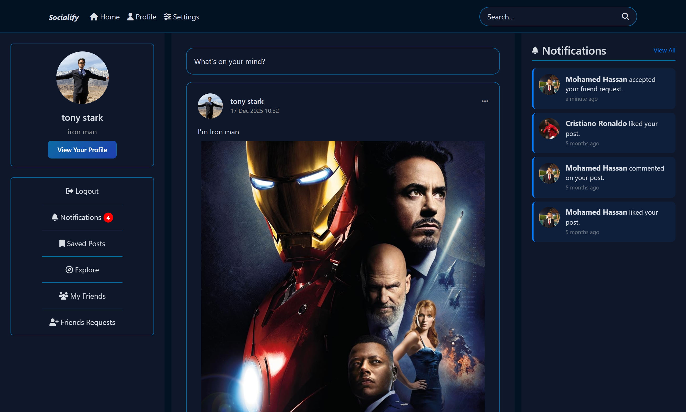
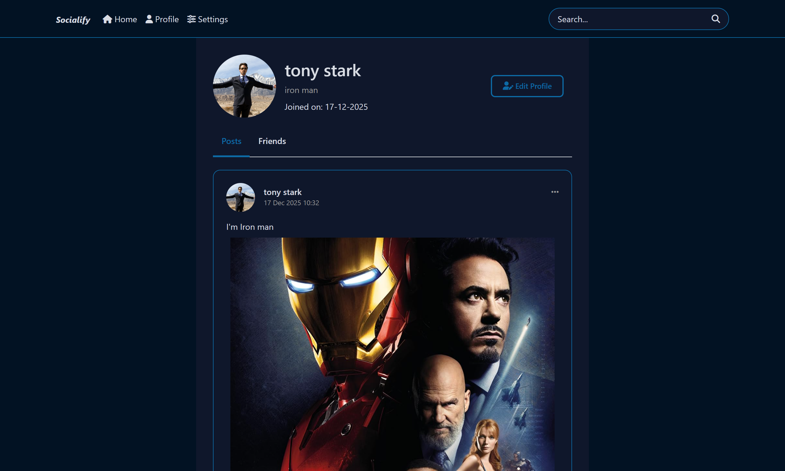
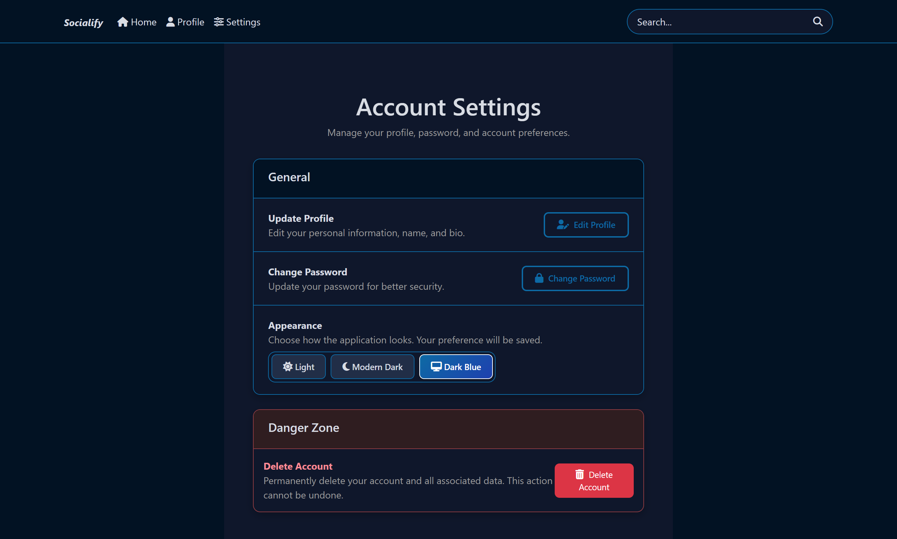
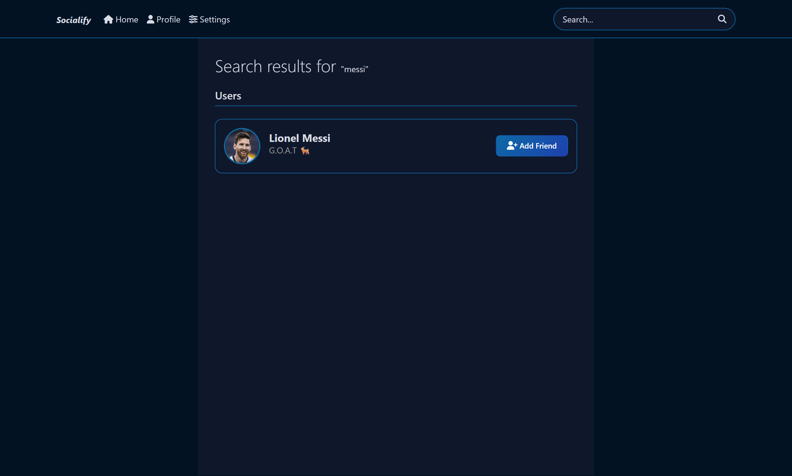
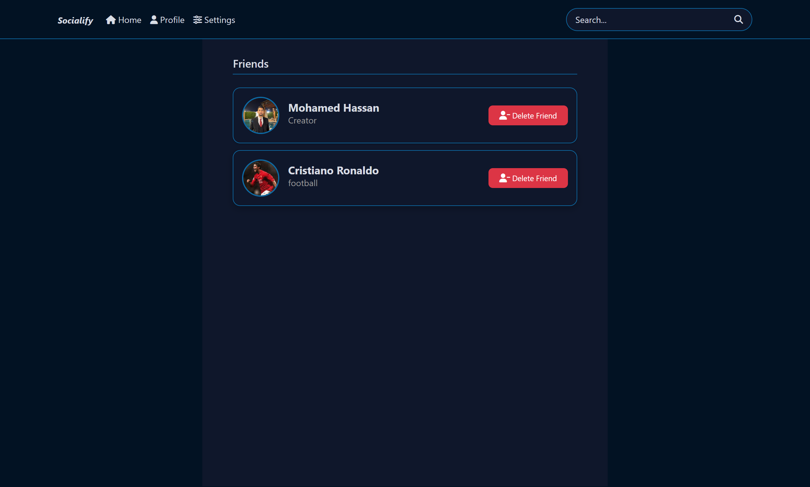
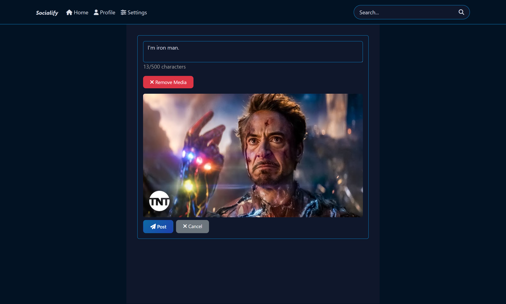

# Socialify 🚀

**Socialify** is a comprehensive Social Networking Web Application built with **ASP.NET Core MVC**, strictly following **Clean Architecture** principles and **SOLID** design patterns. This project demonstrates a high-level implementation of modern backend practices combined with a dynamic and user-friendly interface.

---

## 🏗 Architecture & Design Patterns
The project is structured into four layers to ensure separation of concerns and maintainability:
- **Domain Layer:** Contains enterprise logic, entities, and Domain Events.
- **Application Layer:** Handles business logic using the **CQRS pattern** with **MediatR**.
- **Infrastructure Layer:** Manages external concerns like Data Persistence (SQL Server), Repository implementation, and Logging.
- **Web UI Layer:** Built with ASP.NET Core MVC, implementing custom Middlewares and Filters.

---

## 🛠 Tech Stack & Tools
- **Backend:** .NET Core MVC
- **Database:** Entity Framework Core (SQL Server)
- **Mapping:** **Mapperly** (for high-performance object mapping)
- **Communications:** **SignalR** (for real-time notifications)
- **Architecture Tools:** **MediatR** (Domain Events), **Unit of Work** & **Repository Pattern**.
- **Logging:** **Serilog** (Structured logging)
- **Testing:** **Unit Testing** (xUnit & Moq)
- **Error Handling:** Custom **Middleware** for global exception management.

---

## ✨ Features

### 🔐 Authentication & Account
- [x] Secure Register/Login/Logout system.
- [x] Change password and Edit profile information.
- [x] Account deletion.
- [x] **Custom Auth Filters** for resource-level authorization.

### 📝 Content & Interaction
- [x] **Multi-media Posts:** Support for Articles, Images, Videos, and Audio files.
- [x] **Engagement:** Like, Comment (with Edit/Delete), Share, and Save posts.
- [x] **Feed Logic:** View posts based on user relationships and explore new content.
- [x] **Search:** Advanced search for users and content.

### 👥 Social Networking
- [x] Friend request system (Send, Receive, View friends list).
- [x] **Real-time Notifications:** Instant alerts via SignalR.
- [x] Relationship-based privacy (View posts according to friendship status).

### 🎨 User Experience (UI/UX)
- [x] **Theme Switcher:** Support for 3 distinct themes (**Light, Dark, and Blue**).
- [x] **Custom Pagination:** Efficient data loading for posts and friends to enhance performance.
- [x] Responsive design for various screen sizes.

---

## Screenshots

---

## Contact 🤝
Mohamed Hassan
- [LinkedIn](https://linkedin.com/in/mohamed-hassan2004)
- [GitHub](https://github.com/MohamedHassan2004)